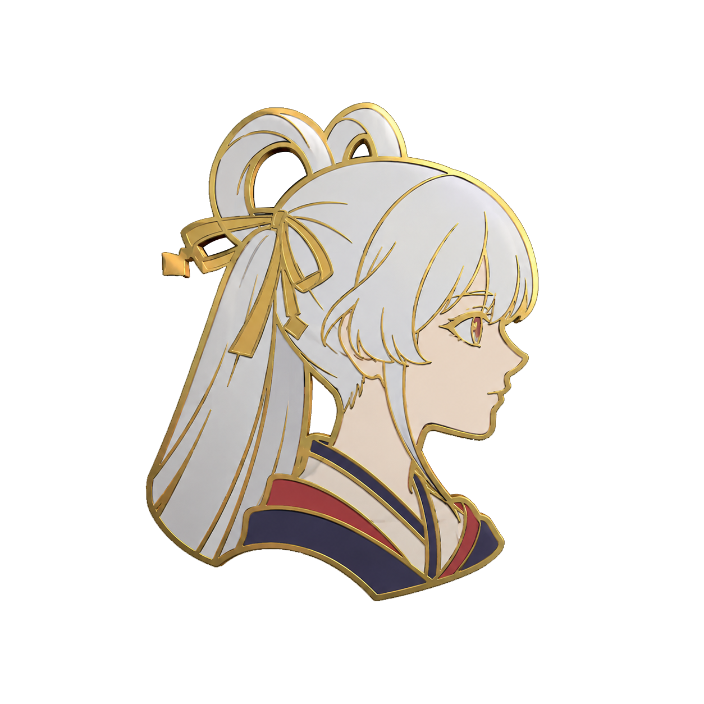

<div align="center">
  
  <h1>YCP 电竞启动器</h1>
  <p>YACHIYO CUP 2026 CS2 官方赛事启动器</p>

  
  
  
  
</div>

---

## 简介

**YCP 电竞启动器**是 YACHIYO CUP 2026 CS2 赛事的官方客户端程序。基于现代化的 WPF 与 .NET 8 构建，专为电竞选手打造。它集成了选手认证、赛事服务器直连、数据统计看板、以及实时直播观看等功能，为您提供稳定、流畅的一站式电竞体验。

## 功能特性

- 🎮 **一键启动 CS2** — 自动带入赛事服务器参数
- 👤 **选手认证登录** — Token 验证，安全可靠
- 🖥️ **服务器列表** — 实时展示赛事服务器状态
- 📊 **选手数据面板** — 赛事数据一览无遗
- 📡 **赛事直播嵌入** — 内置直播观看功能
- 🔄 **自动更新** — 静默下载安装最新版本
- 🌙 **深色 UI** — FluentWPF 亚克力毛玻璃设计

## 系统要求

| 项目 | 要求 |
|------|------|
| 操作系统 | Windows 10 / 11 (x64) |
| 运行时 | [.NET 8 Desktop Runtime](https://aka.ms/dotnet/8.0/windowsdesktop-runtime-win-x64.exe) |
| 磁盘空间 | 约 50 MB |

## 下载安装

前往 **[Releases](https://github.com/sun20101227/YCPLauncher/releases/latest)** 页面下载最新版安装程序 `YCPInstaller.exe`，双击运行即可完成安装。

> **注意**：首次安装需要 .NET 8 Desktop Runtime，安装程序会自动检测并引导下载。

## 项目结构

```
YCPLauncher/          # 主程序 (WPF)
├── Assets/           # 图片资源
├── Converters/       # 数据绑定转换器
├── Helpers/          # 工具类
├── Models/           # 数据模型
├── Services/         # 业务服务层
├── Themes/           # 主题样式
├── ViewModels/       # MVVM ViewModel
└── Views/            # XAML 视图

YCPUninstaller/       # 卸载程序 (WinForms)
YCPInstaller/         # 安装程序 (WPF)
ycp-php/              # 服务端 API (PHP)
ycp-website/          # 官网 (Next.js)
build_all.ps1         # 一键构建脚本
```

## 构建指南

```powershell
# 需要 .NET 8 SDK
.\build_all.ps1
# 安装包输出：.\SetupOutput\YCPInstaller.exe
# 主程序文件：.\YCPLauncher\dist\
```

## 技术栈

- **框架**：C# / WPF / .NET 8.0
- **架构**：MVVM (`CommunityToolkit.Mvvm`)
- **UI**：`FluentWPF`（亚克力背景）、`Hardcodet.NotifyIcon.Wpf`（托盘图标）
- **编译目标**：`win-x64`

---

<div align="center">
  <sub>© 2026 YACHIYO CUP. All rights reserved.</sub>
</div>
